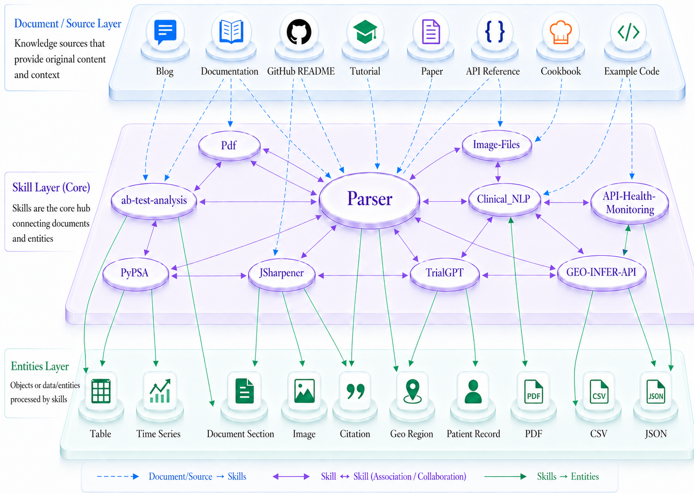

<div align="center">
  <h1>SkillNet-Gym</h1>
</div>

<p align="center">
  A Holistic Framework for Evaluating Agent Skills
</p>
<!-- <p align="center">
  <a href="https://arxiv.org">📄arXiv</a>
</p> -->
<p align="center">
  <a href="https://github.com/zjunlp/SciNet">
  	
  </a>
  <a href="https://github.com/zjunlp/SciNet/blob/main/LICENSE">
    
  </a>
  
  
</p>

------

## 📑 Table of Contents

- [✨ Overview](#-overview)
- [⚒️ Task Synthesis](#-task-synthesis)
- [🚀 Quick Start](#-quick-start)
- [📝 TODO](#-todo)
- [✍️ Citation](#-citation)

## ✨ Overview

SkillNet-Gym is a **live benchmark** for evaluating agents on real, evolving, and diverse community skills. Instead of relying on static, manually curated task snapshots, SkillNet-Gym continuously constructs benchmark tasks from real skill ecosystems through an automated pipeline.

Starting from 200K+ downloaded skills from real community sources, SkillNet-Gym applies automated filtering and quality control to collect **5K+ high-quality** skills spanning diverse domains.


<div align="center">
  Domain Distribution in Collected Skills
</div>

On top of these skills, SkillNet-Gym constructs a **heterogeneous graph** that connects skills with their hierarchical relations, executable entities, and supporting documents, forming a structured foundation for benchmark generation. By grounding evaluation in real, evolving, and graph-connected skills rather than static handcrafted tasks, SkillNet-Gym aims to reduce benchmark staleness and mitigate domain skew in evaluation conclusions.



<div align="center">
  Heterogeneous Skill Graph in SkillNet-Gym
</div>


This repository provides a **live benchmark** for evaluating an agent's ability to **create, execute, and adapt skills** under real-world and continuously evolving skill ecosystems.
Each setting supports **end-to-end evaluation** of an agent's performance on completing tasks. 
In addition, an upcoming open-source task synthesis pipeline will enable users to automatically generate domain-adaptive evaluation tasks.


## ⚒️ Task Synthesis


<div align="center">
  Overview of Pipeline
</div>

SkillNet-Gym synthesizes benchmark tasks by sampling connected subgraphs from the heterogeneous skill graph and turning them into executable, verifiable task instances.

The pipeline focuses on three key steps:

**1. Subgraph Sampling**
Instead of testing isolated skills, SkillNet-Gym samples skill-centered subgraphs that capture realistic workflows involving:

- multiple interacting skills,
- executable entities such as files, datasets, APIs, or databases,
- supporting documents such as manuals, references, and tutorials.
- This allows each task to reflect a real operational context rather than a standalone capability.

**2. Task Instance Synthesis**
For each sampled subgraph, SkillNet-Gym automatically generates:

- a natural language instruction,
- a context pack with relevant documents and entity snapshots,
- an executable environment with required artifacts,
- a reference solution sketch or oracle signal.

**3. Quality Control**
Each synthesized task is paired with automatic verification signals, such as:

- execution-based checks,
- artifact validation,
- test-case evaluation against oracle outputs.

This ensures that generated tasks are not only diverse and realistic, but also objective and reproducible for agent evaluation.
Overall, the task synthesis pipeline enables SkillNet-Gym to benchmark agents on graph-grounded, multi-step, and continuously refreshable workflows, moving beyond static handcrafted task collections.


## 🚀 Quick Start

Use the following steps to get a working run from a clean checkout.

### 1. Installation

```bash
uv tool install harbor
```

### 2. Running Tasks with Harbor

```bash
# Validate task
harbor tasks check tasks/<task-id>

# Run oracle (must pass 100%)
harbor run -p tasks/<task-id> -a oracle

# Run with agent (specify model with -m)
harbor run -p tasks/<task-id> -a claude-code -m 'anthropic/claude-opus-4-5'
```

### Experiment Results


<table>
  <tr>
    <th>Harness</th>
    <th>Model</th>
    <th>Skill Construction</th>
    <th>Skill Execution</th>
  </tr>
  <tr>
    <td rowspan="6">Claude Code</td>
    <td>Claude Opus 4.6</td>
    <td></td>
    <td></td>
  </tr>
  <tr>
    <td>Claude Sonnet 4.6</td>
    <td></td>
    <td></td>
  </tr>
  <tr>
    <td>Claude Haiku 4.5</td>
    <td></td>
    <td></td>
  </tr>
  <tr>
    <td>GLM-5.1</td>
    <td></td>
    <td></td>
  </tr>
  <tr>
    <td>Kimi-K2.6</td>
    <td></td>
    <td></td>
  </tr>
  <tr>
    <td>Minimax-M2.7</td>
    <td></td>
    <td></td>
  </tr>
</table>


## 📝 TODO

- [ ] **Broader and More Comprehensive Coverage.** Expand the benchmark to cover a wider range of Skill types and task categories, including tasks specifically designed to evaluate skill adaptation across different models, harnesses, and environments.
- [ ] **Open-Source End-to-End Task Synthesis Pipeline.** Release the full end-to-end task synthesis pipeline so downstream users can customize and generate their own SkillGym-style benchmarks from their own skill ecosystems, documents, and entities.
- [ ] **Beyond End-to-End Evaluation.** Introduce lightweight testing tasks that do not require full end-to-end execution, enabling cheaper, faster, and more fine-grained evaluation of specific lifecycle abilities such as skill creation, modification, adaptation, and execution bottlenecks.


## Acknowledgement

We deeply appreciate the invaluable effort contributed by our dedicated team of developers, supportive users, and esteemed industry partners.

Tsinghua University
Ant Digital Technologies, Ant Group


## ✍️ Citation

If you find our work helpful, please use the following citations.

```

```

### License

This project is licensed under the MIT License - see the [LICENSE](LICENSE) file for details.
