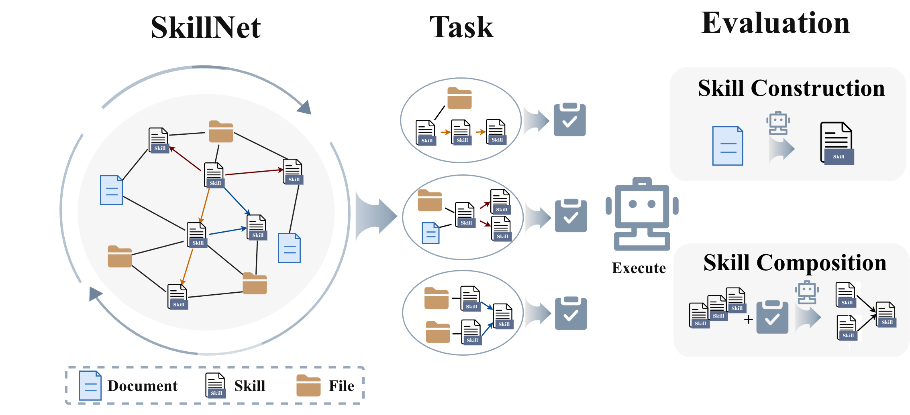
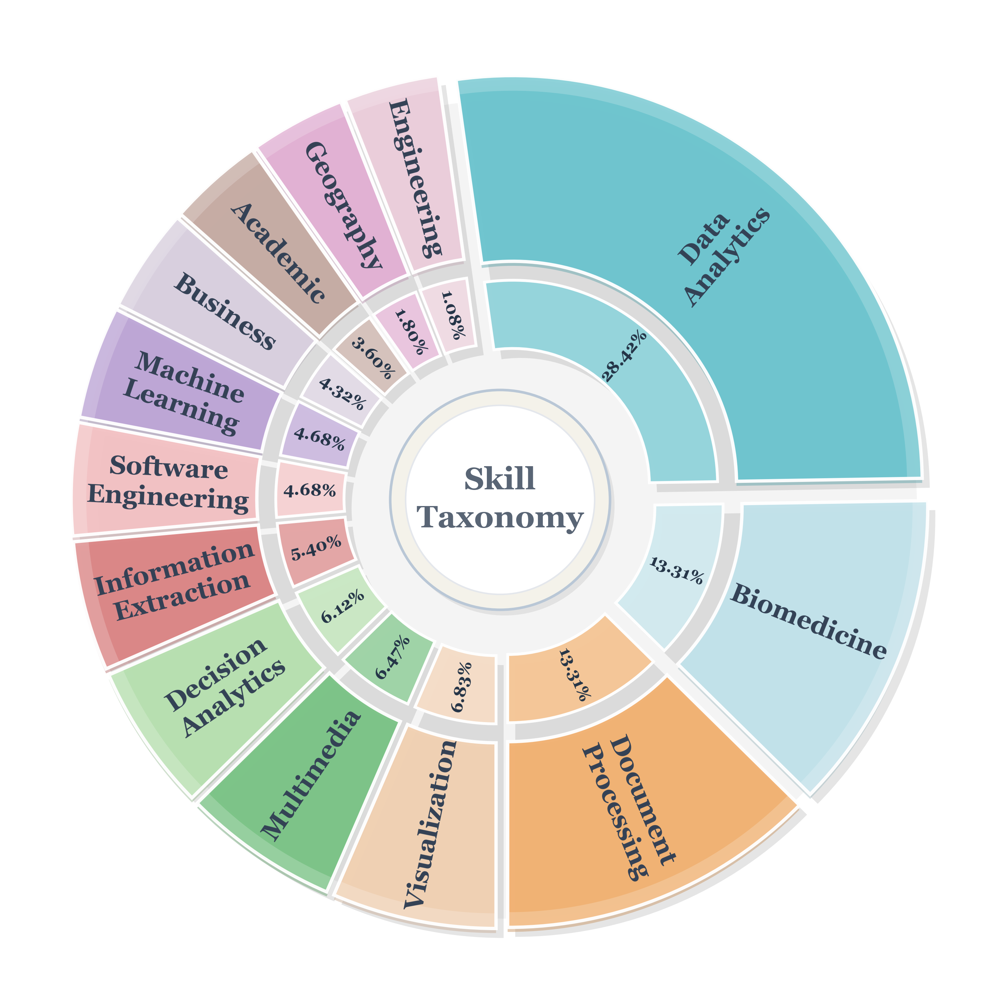
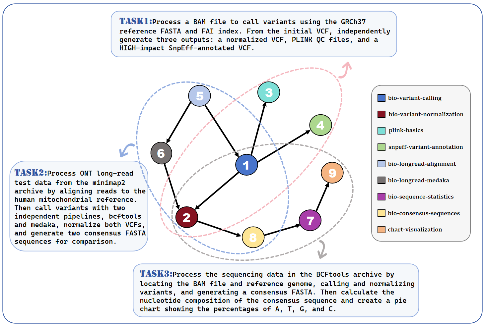

<div align="center">
  <h1>SkillNet-Gym: A Dynamic Benchmark for Compositional Skill Learning</h1>
</div>


<p align="center">
  <a href="https://github.com/zjunlp/SkillNet-Gym" target="_blank">📄arXiv</a> •
  <a href="https://github.com/zjunlp/SkillNet-Gym" target="_blank">🤗HFPaper</a> •
  <a href="https://github.com/zjunlp/SkillNet-Gym" target="_blank">📊Dataset</a> •
</p>


<p align="center">
  <a href="https://github.com/zjunlp/SciAtlas">
    
  </a>
  <a href="https://github.com/zjunlp/SciAtlas/blob/main/LICENSE">
    
  </a>
  
  
</p>
<div align="center">
  
  **SkillNet-Gym turns evolving real-world skill ecosystems into executable, quality-controlled benchmark tasks.**
  
</div>

## 📢 News
- **[2026-07-27] SkillNet-Gym Release**: We release SkillNet-Gym, together with the code for automatic task synthesis and the complete evaluation pipeline.
- **[2026-07-11] SkillNet update**. The library now indexes 500K+ GitHub skills with improved deduplication, expands scientific-research and data-analysis skill coverage, and adds local scenario graphs plus orchestration.


## Table of Contents

- [✨ Overview](#overview)
- [🔧 Installation](#installation)
- [🧭 Benchmark Metadata](#benchmark-metadata)
- [📊 Evaluation](#evaluation)
- [🛠️ Build Your Own Gym](#build-your-own-skillnet-gym)
- [🎁 Acknowledgement](#acknowledgement)
- [🚩 Citation](#citation)

---

## ✨ Overview


LLM agents increasingly solve complex tasks by using **skills**: reusable procedural assets that may contain instructions, workflow recipes, scripts, templates, examples, or references. However, real skill ecosystems are not fixed. New skills appear, old skills become stale, and useful capabilities often emerge only when multiple skills are retrieved and composed in the right order.

**SkillNet-Gym** is a dynamic benchmark for evaluating compositional skill learning. Instead of freezing a manually curated snapshot, SkillNet-Gym starts from community skills and related web artifacts, organizes them into a continuously extensible **SkillNet**, and automatically synthesizes executable tasks that require agents to construct, retrieve, compose, and apply skills.

<p align="center">
  
</p>


Concretely, SkillNet-Gym enables:
- **Dynamic task generation from a living SkillNet.** SkillNet-Gym continuously organizes community skills, documents, and processable files into a heterogeneous SkillNet, then samples compositional subgraphs to synthesize new benchmark tasks. As the external skill ecosystem changes, the benchmark can evolve with it instead of becoming a stale snapshot.
- **Unified evaluation of Skill Construction and Skill Composition.** SkillNet-Gym places no-skill solving, official skill usage, model-constructed skills, wild skill retrieval, and orchestration under one benchmark protocol. This allows researchers to locate whether failure comes from poor skill distillation, incomplete retrieval, wrong dependency ordering, incorrect handoffs, or weak final execution.
- **Task-driven self-adaptation of skills.** Each task is backed by files, gold skills, gold dependency edges, reference solutions, and deterministic verifiers. These tasks can serve as optimization targets for self-adaptive agents: failures suggest whether a skill should be rewritten, expanded, split, merged, re-indexed, re-routed, or re-composed with other skills. In this sense, SkillNet-Gym provides an evaluation foundation for an adaptive closed loop: **evaluate → diagnose → adapt skills → execute tasks**.

---

## 🔧 Installation

For end-to-end evaluation, our task format is compatible with [Harbor](https://github.com/harbor-framework/harbor)'s official automated evaluation framework.

```bash
uv tool install harbor
```

To better support users who may have difficulty pulling or running Docker images, we also modified the [Harbor](https://github.com/sunnychenxiwang/harbor/tree/main) source code to **enable execution in a local Conda environment**. In addition, we ensure that Claude Code and Codex agents can run concurrently in isolated workspaces, preventing interference between parallel agent runs.

To support local Harbor evaluation, we provide scripts for the following steps:

```bash
# Installing Claude Code
npm install -g @anthropic-ai/claude-code
# Installing Harbor in a dedicated environment
git clone https://github.com/sunnychenxiwang/harbor.git
conda run -n conda_env pip install -e harbor
# Installing the Conda environments required by the tasks
```

---

## 🧭 Benchmark Metadata

### Benchmark Settings

SkillNet-Gym enable unified evaluation for compositional skill learning.

| Setting | What the Agent Receives | What It Tests | Main Metric |
| --- | --- | --- | --- |
| **No Skill** | Task instruction and files only | Whether the agent can solve the task without procedural support | `Avg@k` pass rate |
| **Skill Efficacy** | Gold official skills attached to the task | Whether provided skills improve execution | `Avg@k` pass rate |
| **Skill Construction** | Upstream documents or community materials | Whether the agent can distill reusable skills before execution | `Avg@k` pass rate after constructed skill use |
| **Skill Retrieve** | A large wild skill pool | Whether the agent can find all gold skills | Completeness / Recall / Precision |
| **Skill Orchestration** | A large wild skill pool | Whether the agent can recover dependency-aware skill workflows | Graph Completeness / Edge Recall / Edge Precision |
| **In the Wild** | A large skill library during task execution | End-to-end performance under realistic repository noise | `Avg@k` pass rate |


---


### Task Information
SkillNet-Gym spans 13 core domains and 81 sub domains, covering a broad range of practical settings, including data analysis, science, math, technology and so on. In addition, we provide an example showing how biology-related tasks are synthesized.

<p align="center">
  
  
</p>

---
## 📊 Evaluation

For end-to-end task execution and skill composition, we directly use the Harbor evaluation framework.

Evaluation with Docker: 
```bash
harbor run -p tasks/task \
  --agent claude-code \
  -m claude-sonnet-4-6 \
  --ae ANTHROPIC_API_KEY=sk-exxx \
  --ae ANTHROPIC_BASE_URL=xxx
```

Evaluation with Local Conda Environment:
```bash
harbor run --env local \
  --ek conda_env=conda_env \
  -p tasks/task \
  --agent claude-code \
  -m claude-sonnet-4-6 \
  --ae ANTHROPIC_API_KEY=sk-exxx \
  --ae ANTHROPIC_BASE_URL=xxx
```

---

## 🛠️ Build Your Own SkillNet-Gym


SkillNet-Gym is not only a fixed benchmark. It is also a recipe for constructing new dynamic skill benchmarks as the skill ecosystem changes. The core pipeline consists of two stages: **Building a directed skill graph and synthesizing tasks from it.**

1. **Graph construction** (`skillnet_gym.graph`) — search, filter, dedup, and
   scenario-align a corpus of skills into a directed acyclic **skill graph**,
   then sample multi-skill task topologies (chain / fan-in / fan-out / diamond)
   from it.
2. **Task auto-synthesis** (`skillnet_gym.synthesis`) — take a sampled DAG task
   and the skills it references, drive Claude Code through autonomous
   exploration and execution, and package the result as a fully verifiable
   task (`instruction.md`, `solve.sh`, pytest tests, Dockerfile, `task.toml`).

```
   ┌────────────────────────────┐     ┌───────────────────────────────┐
   │  Stage A: Skill Graph      │     │  Stage B: Task Auto-Synthesis │
   │                            │     │                               │
   │  search → filter → dedup   │──▶ │ Input Files summary           |                 
   │        ↓                   │     │        ↓                      |
   │  scenario align → edges    │──▶ │  DAG-guided exploration       │
   │        ↓                   │     │        ↓                      │
   │  DAG build → task sample   │──▶ │  instruction / oracle / tests │
   │        ↓                   │     │        ↓                      |
   │  package env + entities    │──▶ │  ➡  Harbor Task package      |
   └────────────────────────────┘     └───────────────────────────────┘
```

---

### Stage A — Skill graph construction

You may start with a pre-built candidate skill library, or construct the skill graph from search results with the [SkillNet-SDK](https://github.com/zjunlp/SkillNet). See [build_graph.md](https://github.com/zjunlp/SkillNet-Gym/blob/main/docs/build_graph.md) for more details.

---

### Stage B — Task auto-synthesis

Given one packaged task from Stage A (a directory holding a `dag_task.json`,
an `environment/skills/` folder, and input files), synthesize a fully
verifiable coding task:

```bash
# Full DAG-aware pipeline: file summary → exploration → task synthesis
python -m skillnet_gym.synthesis \
    --dag-task packaged_tasks/task-abc123/dag_task.json \
    --entity-folder packaged_tasks/task-abc123/environment \
    --skills-dir packaged_tasks/task-abc123/environment/skills \
    --output ./workspaces
```

Or run phase by phase (useful when iterating on prompts):

```bash
python -m skillnet_gym.synthesis --phase file_summary --entity-folder path/to/files
python -m skillnet_gym.synthesis --phase exploration  --file-summary summaries.json --skills-dir skills/
python -m skillnet_gym.synthesis --phase task_synthesis --exploration summary.md --file-summary summaries.json
```

Output for each task:

```
task_xxx/
├── instruction.md          # LLM-synthesized, quality-filtered
├── solve.sh                # Deterministic oracle solution
├── tests/test_outputs.py   # pytest suite validated against the oracle
├── input/                  # Task input files
├── skills/                 # Skill definitions (SKILL.md + code)
├── Dockerfile              # Reproducible container spec
└── task.toml               # Metadata (difficulty, category, timeouts)
```

### Pipeline internals

The synthesis pipeline runs three phases (see [`docs/architecture.md`](docs/architecture.md)
for details):

| Phase                | Component                                                      | Output                     |
| -------------------- | -------------------------------------------------------------- | -------------------------- |
| **1. File summary**  | `components.file_summarizer`                                    | per-file content type + summary |
| **2. Exploration**   | Claude Code × N checkpointed chunks, DAG-topological           | `exploration_summary.md`   |
| **3. Task synthesis**| instruction → filter → guide → oracle → PRM → pytest → solve.sh | packaged task directory    |

Two LLM roles are used with independent model configuration
(`llm_model_synthesis` / `llm_model_verification`) — both hit the same
OpenAI-compatible endpoint. Claude Code exploration uses a separate Anthropic
model configured via `ANTHROPIC_*`.

---


## 🙏 Acknowledgement
We deeply appreciate the invaluable effort contributed by our dedicated team of developers, supportive users, and esteemed industry partners: [Ant Digital Technologies, Ant Group](https://intl.antdigital.com/en).
This repository develops a benchmark based on [Harbor](https://github.com/harbor-framework/harbor) task types. We sincerely thank all contributors for their outstanding work!

---

## 🚩 Citation

If SkillNet-Gym is useful in your research, please cite the paper (BibTeX
entry to appear here).
