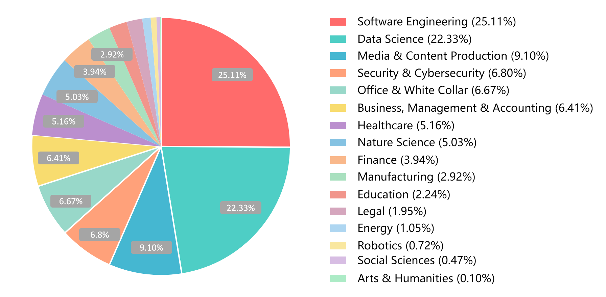
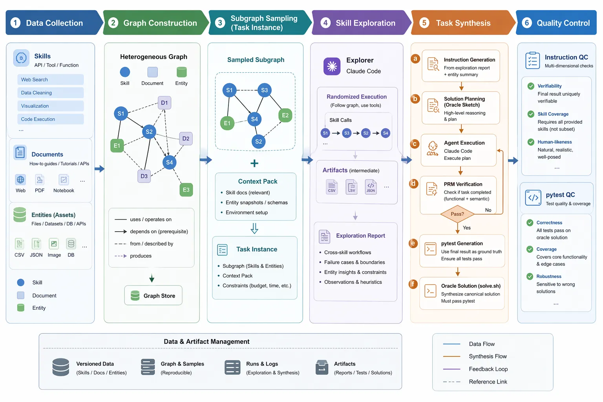

<div align="center">
  <h1>SkillNet-Gym: A Holistic Framework for Evaluating Agent Skills</h1>
</div>

<p align="center">
  A dynamic evaluation gym for skill-centric agents beyond static benchmarks.
</p>
<p align="center">
  <a href="https://arxiv.org/abs/2602.14367">📄arXiv</a>
</p>
<p align="center">
  <a href="https://github.com/zjunlp/SciNet">
  	
  </a>
  <a href="https://github.com/zjunlp/SciNet/blob/main/LICENSE">
    
  </a>
  
  
</p>

------

## 📑 Table of Contents

- [✨ Overview](#-overview)
- [⚒️ Task Synthesis](#-task-synthesis)
- [🧩 Supported Tasks](#-supported-tasks)
- [🛠️ GROBID](#-grobid)
- [📂 Layout](#-repository-layout)
- [🚀 Quick Start](#-quick-start)
- [🧪 Run Tasks](#-run-tasks)
- [📝 TODO](#-todo)
- [✍️ Citation](#-citation)

## ✨ Overview

SkillNet-Gym is a **live benchmark** for evaluating agents on real, evolving, and diverse community skills. Instead of relying on static, manually curated task snapshots, SkillNet-Gym continuously constructs benchmark tasks from real skill ecosystems through an automated pipeline.

Starting from 200K+ downloaded skills from real community sources, SkillNet Gym applies automated filtering and quality control to collect **5K+ high-quality** skills spanning diverse domains.



<div align="center">
  Domain Distribution in Collected Skills
</div>


## ⚒️ Task Synthesis



<div align="center">
  Schema of SciNet
</div>

This repository provides a runnable client for several scientific research workflows, including idea evaluation, topic review, author discovery, author profiling, and idea generation.

Each run is driven by CLI inputs plus optional runtime parameter overrides. The client also writes a `request.json` file into the run directory so every execution remains easy to inspect and reproduce later.

The local client is responsible for:

- building a structured request
- calling a hosted `SciNet API`
- running client-side post-processing such as reranking, PDF parsing, grounding, and Markdown report generation

Users do **not** need to connect to Neo4j or other database components directly.

<table>
  <tr>
    <th>Harness</th>
    <th>Model</th>
    <th>Skill Construction</th>
    <th>Skill Execution</th>
  </tr>
  <tr>
    <td rowspan="6">Claude Code</td>
    <td>Claude Opus 4.6</td>
    <td></td>
    <td></td>
  </tr>
  <tr>
    <td>Claude Sonnet 4.6</td>
    <td></td>
    <td></td>
  </tr>
  <tr>
    <td>Claude Haiku 4.5</td>
    <td></td>
    <td></td>
  </tr>
  <tr>
    <td>GLM-5.1</td>
    <td></td>
    <td></td>
  </tr>
  <tr>
    <td>Kimi-K2.6</td>
    <td></td>
    <td></td>
  </tr>
  <tr>
    <td>Minimax-M2.7</td>
    <td></td>
    <td></td>
  </tr>
</table>


## 🧩 Supported Tasks

| Task Type | Required Input | Main Output |
| --- | --- | --- |
| `Idea Grounding and Evaluation` | `--idea-text` or `--pdf-path` | grounded evidence, paragraph matches, and idea-level analysis |
| `Idea Generation` | `--topic-text` | generated ideas grounded in retrieved literature |
| `Research Trend Predicting` | `--topic-text` | topic evolution summary and representative papers |
| `Related Author Retrieval` | `--idea-text` or `--pdf-path` | related authors and supporting papers |
| `Researcher Background Review` | `--author-name` | research trajectory and representative works |

## 🛠️ GROBID

GROBID extracts structured metadata from scientific PDFs, including titles, authors, abstracts, and references.

GROBID is needed for:

- `Idea Grounding and Evaluation`
- `Related Author Retrieval` when using `--pdf-path`

Example startup with Docker:

```bash
docker pull lfoppiano/grobid:latest
docker run -d --rm --name grobid -p 8070:8070 lfoppiano/grobid:latest
curl http://127.0.0.1:8070/api/isalive
```

## 📂 Layout

This repository is a lightweight client for SciNet workflows.

- `run_scinet.py`: main entrypoint for runs
- `scinet/`: main runtime package, including CLI handling, task dispatch, retrieval, grounding, and Markdown rendering
- `references/search/`: reference and demonstration code for the search logic; it is kept for inspection and illustration, and is not part of the default runtime path

## 🚀 Quick Start

Use the following steps to get a working run from a clean checkout.

### 1. Create an environment and install dependencies

```bash
python3 -m venv .venv
source .venv/bin/activate
pip install -U pip
pip install -r requirements.txt
```

### 2. Create the environment file

```bash
cp .env.example .env
```

Fill in the required variables:

```env
SCINET_API_BASE_URL=https://your-scinet-api.example.com
SCINET_API_KEY=replace-me
SCINET_API_TIMEOUT=120

LLM_PROVIDER=openai_compatible
LLM_API_KEY=replace-me
LLM_BASE_URL=https://your-openai-compatible-endpoint/v1
LLM_MODEL=your-model-name

# Legacy compatibility keys. New setups should prefer LLM_*.
OPENAI_API_KEY=replace-me
OPENAI_BASE_URL=https://your-openai-compatible-endpoint/v1
OPENAI_MODEL=your-model-name

GROBID_BASE_URL=http://127.0.0.1:8070
OA_API_KEY=
OPENALEX_MAILTO=
```

You can get an OpenAlex API key from [here](https://openalex.org/settings/api-key).

Required variables:

| Variable | Required For | Notes |
| --- | --- | --- |
| `SCINET_API_BASE_URL` | all tasks | hosted `SciNet API` base URL |
| `SCINET_API_KEY` | all tasks | sent as `X-API-Key` |
| `LLM_PROVIDER` | all tasks | provider selector, currently `openai_compatible` |
| `LLM_API_KEY` | all tasks | used for planning, reranking, and summarization |
| `LLM_BASE_URL` | all tasks | OpenAI-compatible base URL |
| `LLM_MODEL` | all tasks | chat model name |
| `GROBID_BASE_URL` | PDF tasks | needed for `--pdf-path` flows |
| `OA_API_KEY` | optional | OpenAlex fallback support |
| `OPENALEX_MAILTO` | optional | OpenAlex contact email |

### 3. Make sure the required services are ready

- a hosted `SciNet API`
- an LLM endpoint exposed in OpenAI-compatible format
- GROBID if you want to use `--pdf-path`

### 4. Run a task

```bash
python3 run_scinet.py \
  --task-type "Research Trend Predicting" \
  --topic-text "research idea evaluation with large language models" \
  --pretty
```

### 5. Check the output

Each run creates a directory under `runs/` containing:

- `request.json`
- `result.json`
- `result.md`

## 🧪 Run Tasks

### `Idea Grounding and Evaluation`

```bash
python3 run_scinet.py \
  --task-type "Idea Grounding and Evaluation" \
  --idea-text "Use literature-grounded evidence to evaluate research ideas." \
  --pretty
```

With PDF input:

```bash
python3 run_scinet.py \
  --task-type "Idea Grounding and Evaluation" \
  --pdf-path /absolute/path/to/paper.pdf \
  --params-json '{"search_final_top_k": 15, "manifest_top_k": 10}' \
  --pretty
```

### `Idea Generation`

```bash
python3 run_scinet.py \
  --task-type "Idea Generation" \
  --topic-text "scientific idea generation with retrieval-augmented large language models" \
  --pretty
```

### `Research Trend Predicting`

```bash
python3 run_scinet.py \
  --task-type "Research Trend Predicting" \
  --topic-text "research idea evaluation with large language models" \
  --pretty
```

### `Related Author Retrieval`

```bash
python3 run_scinet.py \
  --task-type "Related Author Retrieval" \
  --idea-text "knowledge-grounded evaluation of scientific research ideas" \
  --pretty
```

### `Researcher Background Review`

```bash
python3 run_scinet.py \
  --task-type "Researcher Background Review" \
  --author-name "Geoffrey Hinton" \
  --pretty
```

You can also override task parameters from your own JSON file:

```bash
python3 run_scinet.py \
  --task-type "Idea Grounding and Evaluation" \
  --idea-text "Use literature-grounded evidence to evaluate research ideas." \
  --params-file /absolute/path/to/params.json \
  --pretty
```

For `Idea Grounding and Evaluation`, model-related overrides can be supplied through `--params-file` or `--params-json`.

`grounded_review` also accepts `query_provider`, `query_model`, and `query_api_url` overrides in `params`.
If omitted, it resolves them from `LLM_PROVIDER`, `LLM_MODEL`, and `LLM_BASE_URL`.

By default, `Idea Grounding and Evaluation` uses:

- embedding model: `BAAI/bge-large-en-v1.5` [huggingface_url](https://huggingface.co/BAAI/bge-large-en-v1.5)
- reranker model: `BAAI/bge-reranker-large` [huggingface_url](https://huggingface.co/BAAI/bge-reranker-large)

The first run may download these models into the local Hugging Face cache.

## 📝 TODO

- [ ] **Broader and More Comprehensive Coverage.** Expand the benchmark to cover a wider range of Skill types and task categories, including tasks specifically designed to evaluate skill adaptation across different models, harnesses, and environments.
- [ ] **Open-Source End-to-End Task Synthesis Pipeline.** Release the full end-to-end task synthesis pipeline so downstream users can customize and generate their own SkillGym-style benchmarks from their own skill ecosystems, documents, and entities.
- [ ] **Beyond End-to-End Evaluation.** Introduce lightweight testing tasks that do not require full end-to-end execution, enabling cheaper, faster, and more fine-grained evaluation of specific lifecycle abilities such as skill creation, modification, adaptation, and execution bottlenecks.


## ✍️ Citation

If you find our work helpful, please use the following citations.

```

```

### License

This project is licensed under the MIT License - see the [LICENSE](LICENSE) file for details.
